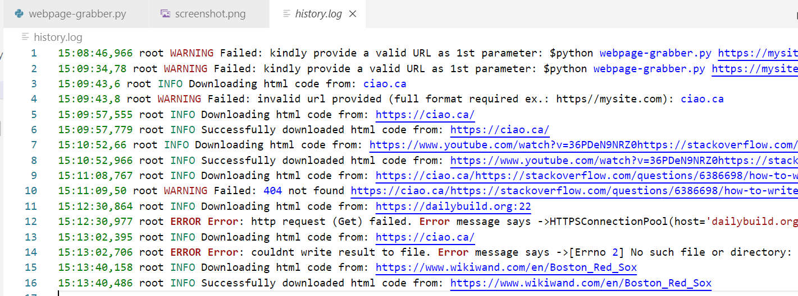

# webpage-grabber

Webpage-grabber script takes a valid URL as CLI argument and downloads the website in ``html`` format.

``$ python webpage-grabber.py https://github.com/socraticDevBlog/webpage-grabber/edit/master/README.md``

> Make sure you have installed these dependencies : 
>
>  - requests
>  - tld

### Use cases

- Keep track of changes to a website thru timestamped source code
- Prepare for a web scraping project and use .html files instead of bothering a website (!)

### All operations and errors are logged and easy to understand

### Add an extra label as a second parameter following the URL to achieve more granular outputted file names

